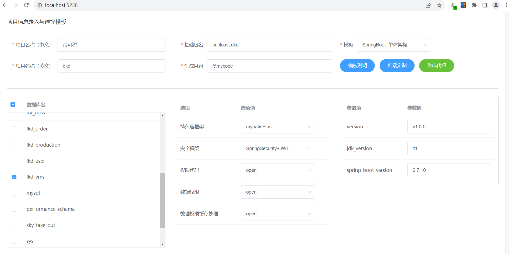
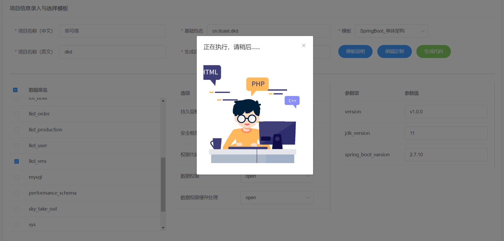
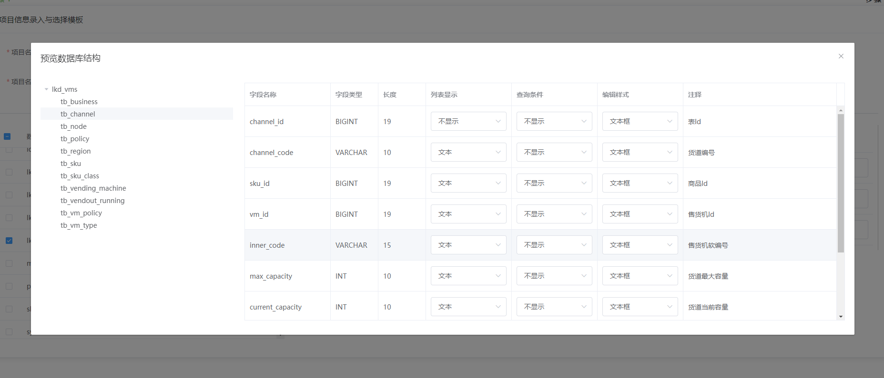

# ElegentBuilder

## 什么是ElegentBuilder

​	ElegentBuilder是一款基于模板的代码生成器。使用ElegentBuilder你可以轻松在一分钟内搭建你的工程代码（前端+后端）。ElegentBuilder内置SpringBoot 单体架构和SpringCloud 微服务架构两套模板，用户还可以自行添加和扩展模板。系统内置的模板可以允许用户选择持久层框架、权限框架等技术方案，自由组合，满足开发公司的个性化需要。

## ElegentBuilder使用步骤

（1）运行elegent-builder-web模块的ElegentBuilderApplication 

（2）打开浏览器，输入  http://localhost:5258 

（3）选择数据库类型 ，输入用户名密码后，点击"**连接数据库**"按钮。

（4）输入项目名称、基础包名、生成目录，并选择模板和你要生成代码的数据库。

点击“生成代码”后，几秒后代码就生成完毕了。

如果你选择了多个数据库，生成的是单体架构的应用，那么就会同时生成多套应用。

如果你生成的微服务架构，选择多个数据库就会生成一套微服务架构的代码框架。

（5）你还可以定制化生成前端代码，定义某个表某字段是否在列表、搜索栏和编辑表单中的表现形式。

